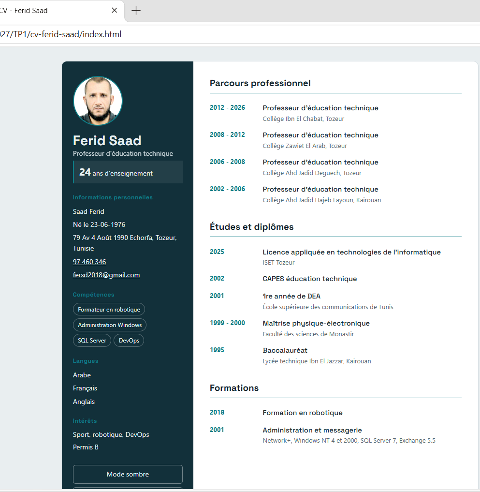

# CV one page - Ferid Saad

Mini CV en HTML5, CSS3 et JavaScript (mode sombre, impression, calcul des années d'enseignement).

## Structure
- `index.html` : contenu
- `style.css` : mise en page
- `script.js` : thème et interactions

## Capture d'écran

## Utilisation
Ouvrir `index.html` dans un navigateur.
